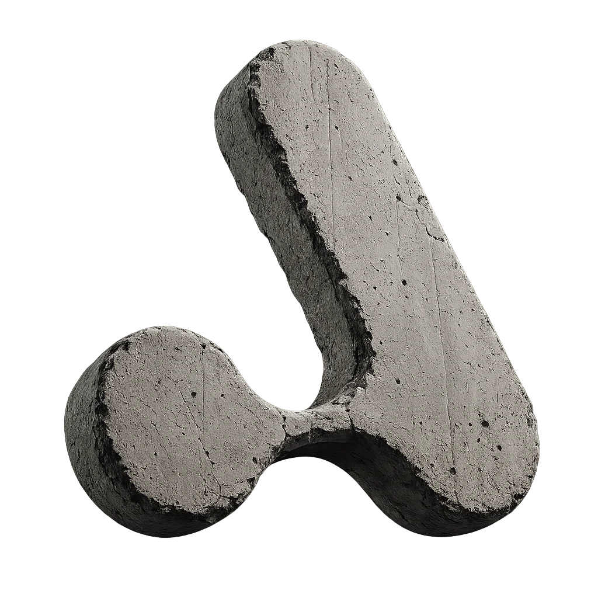
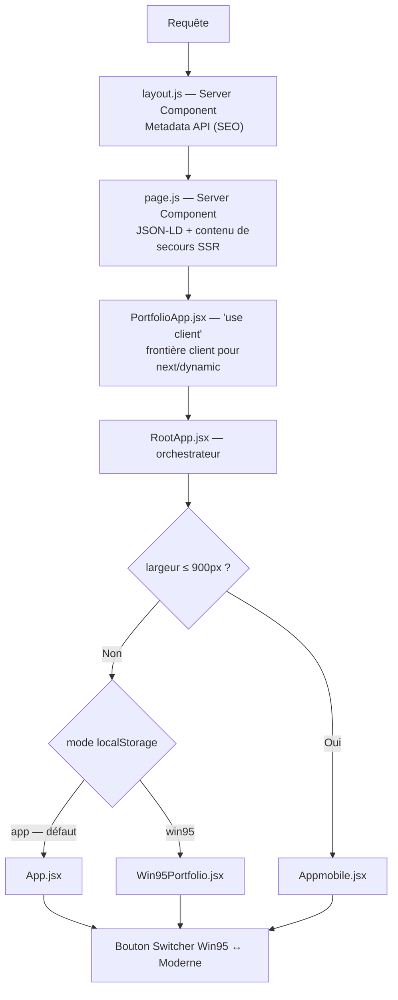

<div align="center">


<br /><br />
# AKAFOLIO — M'Bollo Aka

**Portfolio interactif full-stack** · React 18 · Next.js (App Router) · WebGL · GSAP · Neo-Brutalism

[](https://mbolloaka-dev.vercel.app/)
[](https://akatech.vercel.app/)


*Next.js App Router · 3 expériences actives (Desktop / Mobile / Win95) · Base SSR indexable + expérience immersive client · SEO + AEO/GEO · Thèmes clair/sombre*

</div>

---

## Sommaire

- [À propos](#à-propos)
- [Migration Vite vers Next.js](#migration-vite-vers-nextjs)
- [Architecture](#architecture)
- [Les 3 expériences](#les-3-expériences)
- [Stack technique](#stack-technique)
- [SEO, AEO et GEO](#seo-aeo-et-geo)
- [Bibliothèque de composants](#bibliothèque-de-composants)
- [Structure du projet](#structure-du-projet)
- [Formulaire de contact](#formulaire-de-contact)
- [Installation](#installation)
- [Déploiement](#déploiement)
- [Projets en production](#projets-en-production)
- [Services & tarifs](#services--tarifs)
- [Design system](#design-system)
- [Contact](#contact)

---

## À propos

**AKAFOLIO** est le portfolio personnel d'M'Bollo Aka (akaTech) — développeur web full-stack basé à Abidjan, Côte d'Ivoire. Longtemps SPA React/Vite pure, il tourne désormais sur **Next.js App Router** : la même expérience interactive (animations au scroll pilotées par GSAP, fonds WebGL — OGL / Three.js via React Three Fiber —, carte GitHub en temps réel, formulaire de contact avec envoi d'email réel via Resend, bascule entre une interface **neo-brutalism** moderne et un **easter egg Windows 95** entièrement reconstitué) tourne désormais **au-dessus d'une base réellement indexable côté serveur**, plutôt que dans un `<div id="root"></div>` vide.

Tout est codé sur mesure, sans librairie UI (pas de MUI/Chakra). Le projet regroupe trois expériences front dans le même dépôt — orchestrées par `RootApp.jsx` — plus une quatrième en chantier (`Appv4.jsx`).

---

## Migration Vite vers Next.js

**Le déclencheur :** le SPA React/Vite n'était pas indexé de façon fiable. Tout le SEO (title/meta/OG/JSON-LD) passait par `react-helmet-async`, qui ne fait ce travail que **côté client** — sans pipeline SSG pour le figer dans le HTML statique, un crawler qui n'exécute pas (ou mal) le JS ne voyait qu'un `<div id="root"></div>` vide, avec un `<noscript>` comme seul filet de sécurité. Root cause identifiée avant la migration : SEO 100 % client-side.

Le reste du code (modes, switcher, logique d'orchestration, animations) n'a **pas** été réécrit — seuls les points de friction propres à Vite ont été remplacés :

| # | Avant (React/Vite) | Après (Next.js) | Pourquoi |
|---|---|---|---|
| 1 | `react-helmet-async` | **Metadata API** Next.js (`src/app/layout.js`) + JSON-LD en Server Component (`src/app/page.js`) | Vraiment rendu côté serveur dans le HTML retourné au premier chargement — lu par Google/Bing sans exécuter de JS |
| 2 | `React.lazy` + `Suspense` | `next/dynamic(..., { ssr: false })` | Équivalent Next.js : chaque mode reste chargé à la demande (un seul bundle téléchargé), fallback géré via l'option `loading` |
| 3 | Import CSS `?inline` (Vite) | `scripts/compile-mode-styles.mjs` → `public/styles/*.compiled.css`, chargés via deux `<link rel="stylesheet" disabled={...}>` togglées selon le mode | Next.js n'a pas d'équivalent à `?inline` / `?raw` qui préserve le pipeline PostCSS — confirmé absent en Turbopack comme en Webpack (vercel/next.js #75433, #64964) |
| 4 | `api/contact.js` — Function Vercel autonome | `src/app/api/contact/route.js` — Route Handler (`POST` / `OPTIONS`) | Format natif Next.js ; même logique métier (honeypot, rate-limit, validation, échappement HTML) — seule la signature req/res change |
| 5 | Import direct d'un `.wav` comme module JS | Fichier servi depuis `public/assets/sound/...` (`useImmersiveSound.js`) | Next.js (Turbopack/Webpack) n'a pas de loader intégré pour importer un `.wav` en module JS ; Vite gérait ça nativement |

**Effet de bord positif sur le point 4 :** le client Resend est maintenant instancié **à la demande, dans le handler `POST`**, plutôt qu'au chargement du module. Next.js évalue les routes API pendant `next build` (contrairement à l'ancienne Function Vercel, jamais chargée avant le runtime réel) — instancier Resend au niveau module aurait fait échouer le build si `RESEND_API_KEY` n'était pas présente en environnement de build.

**Bonus DX :** l'ancien setup exigeait deux terminaux en dev pour tester le formulaire de contact (`npm run dev` + `vercel dev --listen 3001`, avec un proxy `vite.config.js` vers `/api`). Next.js exécute nativement les Route Handlers dans `next dev` — un seul `npm run dev` suffit désormais.

**Ambition supplémentaire profitée de la migration :** le SEO ne vise plus seulement Google/Bing, mais aussi les moteurs de réponse génératifs/IA — voir [SEO, AEO et GEO](#seo-aeo-et-geo).

---

## Architecture

`RootApp.jsx` reste le chef d'orchestre (logique identique à avant la migration), mais il est maintenant chargé depuis une base server-rendered plutôt que depuis `index.html` :



| Expérience | Fichier principal | Styles | Statut |
|---|---|---|---|
| **Desktop moderne** | `App.jsx` | `public/styles/style.compiled.css` (précompilé, togglé via `<link disabled>`) | ✅ actif |
| **Mobile** | `Appmobile.jsx` | `public/styles/stylemobile.compiled.css` (idem) | ✅ actif |
| **Win95** | `Win95Portfolio.jsx` | CSS injecté en JS | ✅ actif |
| **V4 (refonte)** | `Appv4.jsx` | `stylev4.css` | 🚧 non branché (jamais monté dans `RootApp.jsx`) |

**Détails d'orchestration**

- Détection viewport : `window.matchMedia('(max-width: 900px)')`, réévalué au resize via `useIsMobile()` — inchangé.
- CSS dynamique : deux `<link rel="stylesheet" disabled={mode !== '...'}>` togglées selon `mode`, alimentées par les fichiers précompilés dans `public/styles/`. Remplace l'ancienne balise unique `<style id="dynamic-portfolio-styles">` repeuplée par texte via `?inline`.
- Persistance du mode : clé `localStorage` `AKAFOLIO-mode`. Trois valeurs valides désormais (`app` | `appmobile` | `win95`, contre deux avant), chacune avec son propre cycle de bascule (`DESKTOP_CYCLE = [app, win95]`, `MOBILE_CYCLE = [appmobile, win95]`).
- En mode Win95, `overflow:hidden` est toujours forcé sur `<html>/<body>/#root` (bureau plein écran) ; restauré au passage en mode moderne.
- Fallback de chargement : `RootLoader()` (spinner minimal, `aria-hidden`) remplace le fallback `Suspense` — affiché par `next/dynamic` pendant le téléchargement du bundle du mode actif.

---

## Les 3 expériences

### Desktop moderne (`App.jsx`)

Esthétique neo-brutalism sur fond sombre (`#0A0A0A` / accent `#FF5500`), bascule vers thème clair possible. Sections dans l'ordre réel (`SECTION_NAV_GROUPS`, vérifié dans le JSX) : Loader (composant partagé `Loader.jsx`, sortie en dissolve WebGL) → Navbar (horloge live, toggle thème) → Hero (`Beams` WebGL + `TextPressure`, pin sticky) → Projets (`ProjectsTunnel` — tunnel WebGL Three.js pinné au scroll, raycasting, starfield + étoiles filantes, modals click-to-expand) → `HeroZoomSection` (clip-path sticky, zoom + dissolve fusionnés en une seule transition) → About (stats animées `AnimatedCounter`, `ScrambleText`) → Timeline (`TimelineBoard` — cartes draggables, GSAP `quickTo` + tilt 3D, fallback tactile) → Skills (`PixelSliceTrail` — logos qui suivent le curseur, révélés par tranches) → Process (stacked cards 1:1) → Services (stacked cards 2:3) → Pricing → **BLOG** (`writing-section`, alimenté par `WRITING_POSTS` — extraits de vrais posts LinkedIn avec lien direct vers chaque post) → Testimonials → FAQ (accordion CSS) → transition CTA (`DissolveTransition`, CTA intégré via `HoverFadeText`) → Contact + Footer (fond `Beams` partagé).

Tous les titres de section passent par un wrapper `SectionHeading` commun qui pilote `GhostParticleText` — ce composant, dormant avant la migration, est désormais actif sur (quasiment) tous les titres de section du site.

`SkewSection` ("Mon Approche" + `FlowingMenu`) est toujours écrite au complet dans le fichier (fonction, JSX, sa propre section `id="skew-section"`) mais toujours jamais appelée dans le rendu — statut inchangé depuis avant la migration, code présent mais pas rendu.

Nav desktop : `StaggeredMenu` (hamburger GSAP, panneaux en cascade, morph plus ↔ X, items avec `GhostParticleText`) — **utilisé côté desktop maintenant**, pas côté mobile (voir ci-dessous, un changement par rapport à avant la migration).

Transitions de section via `GooeyTransition` (effet staircase, 30 lignes en stagger GSAP). Navigation sticky avec `SECTION_NAV_GROUPS` pour le surlignage actif.

### Mobile (`Appmobile.jsx`)

Réécriture mobile-first complète, pas un reflow du desktop. Son propre Hero, ses propres fonds animés (`PlasmaCanvasBg`, `AuroraCanvas`), ses propres variantes de cartes (`FanDeck`, `SpotlightProjects`, `TiltCard`, `StackedCard`), navigation tactile gérée localement (pas de composant de menu partagé — voir `StaggeredMenu` ci-dessus, désormais côté desktop). Utilise `ScrollDepthScene` pour la sortie 3D du Hero, `ScrambleText` pour les effets de décodage de texte, et partage avec le desktop `Loader` (même fichier, variante mobile via l'objet `VARIANTS`), `GooeyTransition`, ainsi que `useSoundSystem` / `SoundToggle`. Pricing par onglets (Portfolio / Vitrine / E-commerce / SaaS / Fiche Google), carte GitHub adaptée.

### Win95 (`Win95Portfolio.jsx`)

Easter egg complet : bureau Windows 95/XP avec curseur custom, horloge, `BootScreen` WebGL, icônes de bureau draggables, fenêtres redimensionnables et déplaçables avec z-index management, `StartMenu`, `Taskbar`. Chaque section du portfolio est une **fenêtre** ouverte depuis le bureau ou le menu Démarrer.

100 % autonome : n'importe **aucun** composant de `src/components/` — seulement `CONTACT`, `PROJECTS`, `TIMELINE`, `PRICING_TABS` et `FAQ_ITEMS` depuis `src/data/portfolioData.js`. `SKILLS` et `SERVICES_DATA` restent locaux au fichier, comme avant la migration.

---

## Stack technique

| Couche | Technologies |
|---|---|
| **Framework** | **Next.js (App Router)** — Server Components + Client Components, `next/dynamic` |
| **UI** | React 18 |
| **Styles** | CSS custom properties (pas de CSS Modules), Tailwind 4 (`@tailwindcss/postcss`, usage partiel) ; modes desktop/mobile précompilés à part — voir [Migration Vite vers Next.js](#migration-vite-vers-nextjs) |
| **Animations** | GSAP 3 (ScrollTrigger, Observer), Framer Motion (`motion`, `AnimatePresence`) |
| **WebGL / 3D** | OGL (`Iridescence`), Three.js + `@react-three/fiber` + `@react-three/drei` + `@react-three/rapier` (`Lanyard` physique), `postprocessing`, `gl-matrix` (`InfiniteMenu`) |
| **Reconnaissance faciale** | `face-api.js` (`GridScan.jsx` — composant présent, non importé actuellement) |
| **Icônes** | `lucide-react`, Font Awesome Free (`@fortawesome/fontawesome-free`) |
| **SEO** | Metadata API Next.js (`app/layout.js`) + JSON-LD en Server Component (`app/page.js`) — voir [SEO, AEO et GEO](#seo-aeo-et-geo) |
| **Contact** | Route Handler Next.js (`app/api/contact/route.js`) + **Resend** |
| **API externes** | GitHub REST API, `github-contributions-api.jogruber.de` |
| **Hébergement** | Vercel |

> `package.json` ne faisait pas partie de l'export utilisé pour rédiger ce README — les numéros de version ci-dessus reprennent ceux déjà documentés avant la migration pour tout ce que le passage à Next.js n'a pas touché (React, GSAP, Three.js, OGL, Framer Motion). À revalider directement dans `package.json` si des mises à jour ont eu lieu entretemps.

---

## SEO, AEO et GEO

Nouveauté directe de la migration : au-delà du SEO classique (désormais réellement server-rendered, voir plus haut), le projet cible aussi explicitement les moteurs de réponse génératifs — ChatGPT, Perplexity, Gemini, etc.

| Fichier | Rôle |
|---|---|
| `src/app/layout.js` | Metadata API Next.js — title, description, keywords, OG, Twitter Card, canonical, `geo.region` / `geo.placename` |
| `src/app/page.js` | JSON-LD (`person`, `localBusiness`, `faq`) en Server Component, plus un contenu de secours HTML (`.seo-fallback`) — pattern *sr-only* (pas `display:none`), visible aux lecteurs d'écran et aux crawlers, sans être du cloaking |
| `public/robots.txt` | Autorise explicitement les crawlers IA : `GPTBot`, `ChatGPT-User`, `PerplexityBot`, `ClaudeBot`, `Google-Extended`, `anthropic-ai` — en plus du `User-agent: *` classique |
| `public/sitemap.xml` | Sitemap one-page avec ancres de section (`#about-section`, `#services-section`, `#pricing-section`, `#testimonials-section`, `#faq-section`, `#contact`) |
| `public/llms.txt` | Fichier structuré pensé pour les crawlers IA/LLM — identité, grille tarifaire complète, stack technique, projets majeurs |
| `public/site.webmanifest` | Manifest PWA — nom, icônes, couleurs de thème (`#0A0A0A` / `#FF5500`) |

---

## Bibliothèque de composants

`src/components/` contient **33 fichiers animés** (32 composants + le hook `useClickSound.js`), pour l'essentiel des adaptations maison. Statuts vérifiés par grep des imports **et** des usages JSX dans `App.jsx` / `Appmobile.jsx` / `Win95Portfolio.jsx` / `Appv4.jsx`.

| Composant | Rôle | Statut |
|---|---|---|
| `AnimatedCounter.jsx` | Compteur animé (pur React, pas de dépendance GSAP) — s'active à l'entrée dans le viewport. Props : `target`/`suffix`/`duration`/`delay`/`ease` | Utilisé — stats About (`App.jsx`, `Appv4.jsx`) |
| `AnimatedSections.jsx` | Stack de slides `fixed` + GSAP `Observer` (molette/tactile) ; remplace un ancien `StickyStack`, inspiré d'un lab perso (`prochain.html`) | Non importé actuellement |
| `Beams.jsx` | Fond de faisceaux lumineux 3D — matériau shader Three.js étendu (`extendMaterial` sur `THREE.ShaderLib.physical`) via React Three Fiber | Utilisé — Hero + Footer (`App.jsx`) |
| `CardSwap.jsx` | Pile de cartes qui s'échangent en boucle (GSAP) ; exporte aussi le sous-composant `Card` | Utilisé — `App.jsx` |
| `DissolveTransition.jsx` | Transition shader WebGL "dissolve" entre deux plans (front qui se dissout / back qui se révèle), glow de bord façon "scan" + grain de bruit — pilotée par `ScrollTrigger` (scrub) plutôt qu'un rAF continu. Exporte ses shaders (réutilisés par `Loader.jsx`) et intègre `HoverFadeText` pour son CTA | Utilisé — `App.jsx` |
| `FireAkatech.jsx` | Animation de flammes GSAP (60 layers + canvas d'embers), prévue pour remplacer le bloc `.ft-aka-wrap` du footer | Non importé actuellement |
| `FireBackground.jsx` | Simulation de feu cellulaire façon demoscene sur canvas 2D — grille de chaleur qui diffuse vers le haut, palette noir → rouge → orange → jaune → blanc ; fond du bloc QR/CV du footer | Non importé actuellement |
| `FlowingMenu.jsx` | Menu marquee au survol (GSAP) | Écrit et importé dans `App.jsx`, mais seulement utilisé à l'intérieur de `SkewSection()`, qui n'est jamais appelée — non rendu en pratique |
| `GhostParticleText.jsx` | Effet "particules fantômes" au survol (scramble, jeu de caractères custom `*+;·:.`) | **Désormais actif** — intégré au wrapper `SectionHeading` commun (tous les titres de section) et dans `StaggeredMenu` |
| `GooeyTransition.jsx` | Transition "10 Volets Lignes Fines" (30 lignes verticales en stagger GSAP) ; exporte `runGridTransition` (impératif, ex. loader) et `useGooeyTransition` (hook `goTo(sectionId)`) | Utilisé — `App.jsx`, `Appmobile.jsx`, `Appv4.jsx` |
| `GridScan.jsx` | Scan facial temps réel (`face-api.js`) + post-processing (bloom, aberration chromatique) via shader Three.js | Non importé actuellement |
| `HorizontalSections.jsx` | Navigation horizontale via scroll vertical capturé (GSAP `Observer`, double-wrap outer/inner) | Non importé actuellement |
| `HoverFadeText.jsx` | **Nouveau.** Effet de survol "V-Fade-X" : le texte glisse et s'efface vers la droite pendant qu'une copie identique glisse et apparaît depuis la gauche, décalée lettre par lettre. Timeline GSAP suspendue par défaut (pas d'autoplay), 2ᵉ couche `aria-hidden`. Extrait en fichier séparé pour rester importable aussi depuis `DissolveTransition.jsx` sans dépendance circulaire avec `App.jsx` | Utilisé — `App.jsx`, `DissolveTransition.jsx` |
| `ImageTrail.jsx` | Traînée de logos/images qui suit le curseur (marquee CSS-driven, GPU-friendly) | Utilisé — `Appv4.jsx` |
| `InfiniteMenu.jsx` | Menu sphérique 3D en WebGL pur (`gl-matrix`) | Utilisé — `Appv4.jsx` |
| `Iridescence.jsx` | Fond shader irisé (OGL) | Utilisé — `Appv4.jsx` |
| `Lanyard.jsx` | Badge 3D avec physique réaliste (`@react-three/rapier`, corde `meshline`) | Utilisé — `Appv4.jsx` |
| `Loader.jsx` | **Nouveau (fusion).** Composant de chargement unique partagé desktop/mobile — compteur, liquid blur, explosion des lettres du nom/rôle. Différences desktop/mobile isolées dans un objet `VARIANTS` (préfixe de classes CSS, textes, magnitudes de l'explosion en X/Y/Z) ; sortie en dissolve WebGL (shaders réutilisés de `DissolveTransition.jsx` — sobel edge-glow + sparkle radial) plutôt qu'un fade opacity plat | Utilisé — `App.jsx`, `Appmobile.jsx` |
| `PixelSliceTrail.jsx` | Logos qui suivent le curseur, révélés par un balayage de tranches `clip-path` ; port React du moteur vanilla d'un lab perso (`image.html`), adapté pour afficher des cartes (`object-fit: contain`) plutôt qu'un `background-image: cover` qui aurait rogné des logos non carrés | Utilisé — Skills (`App.jsx`) |
| `RotatingText.jsx` | Rotation de mots (Framer Motion, intervalle configurable, défaut 2 500 ms) | Utilisé — `Appv4.jsx` |
| `ScrambleText.jsx` | Texte qui se décode lettre par lettre à l'entrée dans le viewport ; inspiré d'une démo issue du projet NEXURA (`GRG.html`) | Utilisé — `Appmobile.jsx`, `Appv4.jsx` |
| `ScrollDepthScene.jsx` | Scène 3D Three.js de profondeur au scroll (sortie du Hero en "blast" — scale/opacity/blur), pilotée par `ScrollTrigger` | Utilisé — `Appmobile.jsx` |
| `ScrollFloat.jsx` | Révélation animée au scroll : texte splitté en caractères, stagger GSAP, bornes configurables (`scrollStart`/`scrollEnd`) | Non importé actuellement |
| `ScrollReveal.jsx` | Révélation au scroll — **version durcie pour la prod** : les éléments sont visibles par défaut (aucun style qui les cache), `IntersectionObserver` natif sans dépendance GSAP. Corrige un bug identifié en prod (connexion lente / cold start Vercel) où les titres restaient bloqués en `opacity:0` | Utilisé — `App.jsx`, `Appv4.jsx` |
| `Shuffle.jsx` | Effet de décodage — port de "react-bits Shuffle-JS-CSS" sans les plugins payants GSAP Club (rAF + `IntersectionObserver`) | Utilisé — `App.jsx`, `Appv4.jsx` |
| `ShuffleText.jsx` | Variante d'effet de décodage (jeu de caractères + ponctuation en passthrough) | Non importé actuellement |
| `SoundToggle.jsx` | Bouton mute/unmute relié à `useClickSound` | Utilisé — `App.jsx`, `Appmobile.jsx`, `Appv4.jsx` |
| `Stack.jsx` | Pile de cartes drag-to-dismiss (Framer Motion, rotation 3D au drag) | Utilisé — `Appv4.jsx` |
| `StaggeredMenu.jsx` | Menu hamburger — panneau latéral fond `#0A0A0A`, panneaux en cascade GSAP, stagger nav, morph plus ↔ X, items avec `GhostParticleText` | Utilisé — `App.jsx` **(desktop uniquement — voir Appmobile)** |
| `TargetCursor.jsx` | Curseur custom avec ciblage GSAP sur les éléments `.cursor-target` | Utilisé — `App.jsx`, `Appv4.jsx` |
| `TextPressure.jsx` | Typographie réactive à la distance du curseur (poids/largeur variables) | Utilisé — `App.jsx`, `Appv4.jsx` |
| `ui/icon-cloud.jsx` | Nuage d'icônes flottantes (positions pseudo-aléatoires par formule, pas de collision physique) | Non importé actuellement |
| `useClickSound.js` | Hook global `useSoundSystem()` — sons de clic synthétisés (Web Audio, `OscillatorNode` + `BiquadFilter`, zéro asset externe), raccourci clavier `S` pour mute, badge indicateur flottant (2s) | Utilisé — `App.jsx`, `Appmobile.jsx`, `Appv4.jsx` |

> **Composant retiré depuis la version React/Vite :** `SectionSlider.jsx` n'existe plus dans le dépôt Next.js (il était déjà "non importé actuellement" avant la migration).
>
> "Non importé actuellement" = fichier toujours présent et fonctionnel, juste pas branché dans le rendu en ce moment (pas forcément à supprimer, réactivable au besoin). `Win95Portfolio.jsx` n'importe aucun composant de cette bibliothèque (voir [Les 3 expériences](#les-3-expériences)).

### Hooks

| Fichier | Rôle |
|---|---|
| `src/components/useClickSound.js` | Voir tableau ci-dessus — `useSoundSystem()` |
| `src/hooks/useImmersiveSound.js` | Ambiance sonore en boucle (fichier réel, servi depuis `public/assets/sound/immersion-loop.wav` — voir [Migration Vite vers Next.js](#migration-vite-vers-nextjs), point 5). Démarre à la fin de l'explosion du nom/rôle du Loader (`started` → true), boucle nativement via `<audio>`, fondu d'entrée de 2,4 s, coupée par le même mute global (`S`) que les sons de clic — sans poser son propre listener clavier, pour ne jamais entrer en conflit avec `useSoundSystem` |

---

## Structure du projet

```
elvis-portfolio/
├── src/
│   ├── app/                        # App Router Next.js
│   │   ├── layout.js               # Server Component — Metadata API (SEO)
│   │   ├── page.js                 # Server Component — JSON-LD + fallback SEO SSR
│   │   ├── PortfolioApp.jsx        # 'use client' — frontière client pour next/dynamic
│   │   ├── globals.css             # Reset + .seo-fallback (pattern sr-only)
│   │   └── api/
│   │       └── contact/
│   │           └── route.js        # Route Handler — POST/OPTIONS, envoi email via Resend
│   │
│   ├── RootApp.jsx                 # Orchestrateur : viewport, mode, CSS togglée
│   ├── App.jsx                     # Desktop moderne
│   ├── Appmobile.jsx               # Mobile
│   ├── Win95Portfolio.jsx          # Easter egg Win95
│   ├── Appv4.jsx                   # Refonte V4 (non montée)
│   ├── useSEO.jsx                  # SEO_CONFIG + STRUCTURED_DATA — consommés par app/layout.js et app/page.js
│   │
│   ├── data/
│   │   └── portfolioData.js        # PROJECTS (19), PRICING_TABS, TIMELINE, FAQ_ITEMS, WRITING_POSTS, CONTACT.
│   │                                # Importé par Appmobile/Win95/Appv4 — App.jsx garde ses propres
│   │                                # copies locales (voir Conventions, section Design system).
│   │
│   ├── style.css                   # Thème desktop (précompilé par le script ci-dessous)
│   ├── stylemobile.css             # Thème mobile (idem)
│   ├── stylev4.css                 # Thème V4
│   ├── fonts.css                   # Polices @fontsource (zéro CDN externe)
│   ├── index.css
│   ├── components/                 # 33 fichiers animés (voir Bibliothèque de composants)
│   └── hooks/
│       └── useImmersiveSound.js    # Musique d'ambiance procédurale — fichier servi depuis public/
│
├── scripts/
│   └── compile-mode-styles.mjs     # Précompile style.css / stylemobile.css → public/styles/*.compiled.css
│                                    # avec les mêmes plugins PostCSS que le reste du projet.
│                                    # Remplace l'import Vite `?inline` — tourne avant dev/build (hooks
│                                    # npm predev/prebuild).
│
├── public/
│   ├── styles/                     # CSS compilé (généré par le script ci-dessus)
│   │   ├── style.compiled.css
│   │   └── stylemobile.compiled.css
│   ├── assets/                     # Images, CV, sons, icônes
│   ├── llms.txt                    # AEO/GEO — voir SEO, AEO et GEO
│   ├── robots.txt                  # Allowlist crawlers IA (GPTBot, ClaudeBot, PerplexityBot...)
│   ├── sitemap.xml
│   └── site.webmanifest
│
├── next.config.js
├── postcss.config.mjs              # Référencé par scripts/compile-mode-styles.mjs
├── tailwind.config.js
└── package.json
```

> Les fichiers de configuration racine (`package.json`, `next.config.js`, `postcss.config.mjs`, `tailwind.config.js`) ne faisaient pas partie de l'export utilisé pour rédiger ce README — leur présence ci-dessus est déduite des chemins et imports détectés dans le code (`compile-mode-styles.mjs` référence explicitement `postcss.config.mjs`, par exemple).

---

## Formulaire de contact

L'endpoint `src/app/api/contact/route.js` (Route Handler Next.js) reçoit les `POST /api/contact` et envoie un email HTML stylisé via **Resend**. Migré depuis l'ancienne Function Vercel autonome (`api/contact.js`) — même logique métier, seule la signature change (`Request`/`NextResponse` au lieu de `req`/`res`).

Fonctionnalités :
- **Validation** : nom (≤ 100 car.), email (regex), message (10–5 000 car.), et un champ **type de projet** (`projectType` — site vitrine / e-commerce / application web·SaaS / API·backend / dashboard·data / maintenance / candidature spontanée / autre)
- **Honeypot anti-spam** : champ caché `company` — si rempli, réponse `200` factice sans envoi
- **Rate-limit** : 3 messages / IP / minute (mémoire de la function, best-effort — se réinitialise si l'instance serverless redémarre ou scale sur une autre instance)
- **Échappement HTML** des champs avant injection dans le template (anti-injection)
- **CORS** : headers dédiés (`Access-Control-Allow-*`) + handler `OPTIONS`

**Détail d'implémentation notable :** le client Resend est instancié **à l'intérieur** du handler `POST` plutôt qu'au niveau module — le SDK lève une erreur immédiate si `RESEND_API_KEY` est absente, ce qui ferait échouer `next build` (Next.js évalue les routes API pendant le build, contrairement à l'ancienne Function Vercel qui n'était jamais chargée avant le runtime réel).

**Variables d'environnement requises en production :**

| Variable | Rôle | Défaut |
|---|---|---|
| `RESEND_API_KEY` | Clé API Resend (obligatoire) | — |
| `FROM_EMAIL` | Adresse d'expédition | `onboarding@resend.dev` |
| `ADMIN_EMAIL` | Adresse de réception | `wthomasss06@gmail.com` |

En dev local : `npm run dev` suffit désormais — la Route Handler tourne nativement dans `next dev`. Plus besoin du second terminal `vercel dev --listen 3001` ni du proxy `/api` de l'ancien `vite.config.js`.

---

## Installation

**Prérequis :** Node.js ≥ 18, npm ≥ 9.

```bash
# Installer les dépendances
npm install

# Serveur de développement — compile automatiquement style.css/stylemobile.css
# (hook predev → scripts/compile-mode-styles.mjs), puis lance Next.js
npm run dev

# Build production → .next/
npm run build

# Démarrer le build en production
npm run start
```

> **Modifier `src/style.css` ou `src/stylemobile.css` pendant `next dev` ?** Il faut relancer `npm run dev`. Ces deux fichiers passent par le script de précompilation (`predev`/`prebuild`) plutôt que par le pipeline CSS natif de Next.js, donc pas de hot-reload live spécifiquement dessus — tout le reste du projet garde le hot-reload normal de Next.js.

---

## Déploiement

Pensé pour **Vercel** :

1. Framework preset : **Next.js** (auto-détecté)
2. Build command : `npm run build` (défaut Next.js)
3. Ajouter `RESEND_API_KEY` (+ optionnellement `FROM_EMAIL`, `ADMIN_EMAIL`) dans les variables d'environnement Vercel
4. Plus besoin de `vercel.json` pour un rewrite SPA fallback — Next.js gère nativement son routing via l'App Router

---

## Projets en production

| # | Projet | Description | Stack | Lien |
|---|---|---|---|---|
| 1 | ShopCI | Marketplace multi-vendeurs, fiabilité & visibilité pour le e-commerce local ivoirien | React, Django, Bootstrap 5, Vercel + PythonAnywhere | [shop-ci.vercel.app](https://shop-ci.vercel.app/) *(repo privé)* |
| 2 | TechFlow | Site vitrine one-page, rapide, orienté conversion | HTML/Tailwind CSS, JavaScript, Vercel | [techflow-ten.vercel.app](https://techflow-ten.vercel.app/) |
| 3 | TerraSafe | Marketplace foncière anti-arnaque, recherche avancée | Python/Flask, MySQL, Bootstrap 5 | [wthomassss06.pythonanywhere.com](https://wthomassss06.pythonanywhere.com) |
| 4 | Chap-chapMAP | Cartographie intelligente, géoloc temps réel + itinéraires optimisés | JavaScript, Leaflet.js, OSRM API, Geolocation API | Démo intégrée (`/demos/chap-chapMAP.html`) |
| 5 | ElvisMarket | Interface e-commerce d'entraînement (état, panier dynamique) | HTML/JS vanilla, Tailwind CSS, LocalStorage | Démo intégrée (`/demos/projet2.html`) |
| 6 | MonCashJour | Gestion de ventes quotidiennes pour petits commerçants | HTML/JS vanilla, Tailwind CSS, Chart.js | Démo intégrée (`/demos/projet1.html`) |
| 7 | LivreurTrack Pro | Suivi logistique, validation par photo (Camera API) | JavaScript, Bootstrap 5, LocalStorage, Camera API | Démo intégrée (`/demos/projet3.html`) |
| 8 | LinkedIn Banner Pro | Générateur de bannières LinkedIn (SaaS) | JavaScript, Canvas API, Tailwind CSS | 🚧 En cours (`/demos/projet7.html`) |
| 9 | Tati | Portfolio personnel double fonction, thème clair/sombre | React, Tailwind CSS, Framer Motion, Vercel | [tatii.vercel.app](https://tatii.vercel.app/) |
| 10 | MK | Portfolio graphiste — galerie immersive | React, Tailwind CSS, Framer Motion, Vercel | [mory01ff.vercel.app](https://mory01ff.vercel.app/) |
| 11 | ManoBeat 777 | Portfolio beatmaker, lecteur audio intégré | React, Tailwind CSS, Howler.js, Vercel | [xxx-x.vercel.app](https://xxx-x.vercel.app/) |
| 12 | New Horizon Service | Location de résidences meublées haut de gamme | Next.js, Flask, Python, MySQL, Vercel | [new-horizonservice.vercel.app](https://new-horizonservice.vercel.app/) |
| 13 | akaTech | Site officiel de l'agence — WebGL Aurora | Next.js 15, Framer Motion, WebGL Aurora, Vercel | [akatech.vercel.app](https://akatech.vercel.app/) |
| 14 | Université les Anges | Site institutionnel (filières, inscriptions) | HTML, CSS, Bulma, Bootstrap, Vercel | [universitelesanges.vercel.app](https://universitelesanges.vercel.app/) |
| 15 | NEXURA | Marketplace nouvelle génération — évolution de TerraSafe. KYC intégré, temps réel | Next.js 14, Django REST, PostgreSQL, WebSockets, Redis & Celery | [nexura-one.vercel.app](https://nexura-one.vercel.app/) *(repo privé)* |
| 16 | KokoEat | Livraison alimentaire, Mobile Money (marché ivoirien) | React, Django REST, PostgreSQL, Vercel | 🚧 En cours |
| 17 | Jean Edy · Portfolio | Portfolio développeur — direction skeuomorphisme | React 18, Vite, GSAP, Framer Motion, Tailwind CSS | [jean-edy-dev.vercel.app](https://jean-edy-dev.vercel.app/) *(repo privé)* |
| 18 | MD Laverie Pressing | Vitrine pressing Abidjan — hero slider, formulaire EmailJS | React 18, Vite, GSAP, React Router v6, EmailJS | [laverie-plus.vercel.app](https://laverie-plus.vercel.app/) |
| 19 | Chez Florence | Vente & réservation de lapins — stock temps réel, notification WhatsApp auto | Next.js 14, Express.js, Prisma, PostgreSQL (Neon), Cloudinary | [lapinou.vercel.app](https://lapinou.vercel.app/) |

---

## Services & tarifs

<details>
<summary><b>Portfolio personnel</b></summary>

| Plan | Prix | Délai |
|---|---|---|
| Starter | 100 000 FCFA | 3–5 jours |
| Standard | 175 000 FCFA | 5–7 jours |
| Premium | 275 000 FCFA | 7–10 jours |

</details>

<details>
<summary><b>Site vitrine</b></summary>

| Plan | Prix | Délai |
|---|---|---|
| Starter | 220 000 FCFA | 5–7 jours |
| Pro | 350 000 FCFA | 7–10 jours |
| Elite | 550 000 FCFA | 10–14 jours |

</details>

<details>
<summary><b>E-commerce</b></summary>

| Plan | Prix | Délai |
|---|---|---|
| Starter | 450 000 FCFA | 14 jours |
| Pro | 750 000 FCFA | 21 jours |
| Elite | 1 200 000 FCFA | 30 jours |

</details>

<details>
<summary><b>Application SaaS</b></summary>

Sur devis après diagnostic gratuit. Devis détaillé sous 48h.

</details>

<details>
<summary><b>Fiche Google Business</b></summary>

| Plan | Prix | Délai |
|---|---|---|
| Création | 20 000 FCFA | 1–2 jours |
| Optimisation | 12 000 FCFA | 1 jour |
| Suivi mensuel | 10 000 FCFA/mois | Continu |

</details>

> Nom de domaine + hébergement offerts la 1ère année sur tous les plans (hors Fiche Google et SaaS sur devis).
> Paiements acceptés : Orange Money · MTN Mobile Money · Wave

---

## Design system

Variables CSS principales (`style.css`) :

```css
:root {
  --bg:      #0A0A0A;
  --text:    #F2EDE8;
  --accent:  #FF5500;
  --muted:   /* gris secondaire */;
  --fd:      /* police display */;
}

body.light-mode {
  --bg:   #FFFFFF;
  --text: #0A0A0A;
}
```

Le Hero reste verrouillé en thème sombre quelle que soit la sélection globale.

**Typographies** (bundlées via `@fontsource`, zéro CDN) : Outfit, Syne, Space Mono, Plus Jakarta Sans, Lora.

**Conventions :**
- Animations scroll-driven : mutation DOM directe sur refs, pas de React state (perf)
- `overflow: hidden` sur un parent casse `position: sticky` — utiliser `overflow-x: clip`
- Indentation JSX : 1 espace · CSS : 3 espaces
- CSS des modes desktop/mobile précompilée par `scripts/compile-mode-styles.mjs` (mêmes plugins PostCSS que le reste du projet) vers `public/styles/*.compiled.css`, chargée via deux `<link disabled={...}>` togglées par `RootApp.jsx` — remplace l'injection de `<style>` par texte (`?inline` Vite). Une seule feuille active à la fois : `style.css` et `stylemobile.css` définissent les mêmes variables (`--border`, `--fd`, `--fb`, `--muted`...) avec des valeurs incompatibles entre elles.
- Dual codebase : `App.jsx` (desktop) et `Appmobile.jsx` (mobile) maintenus en parallèle pour le rendu/l'UI. Le **contenu** (projets, tarifs, FAQ, parcours, posts blog) est centralisé dans `src/data/portfolioData.js`, importé par `Appmobile.jsx`, `Win95Portfolio.jsx` et `Appv4.jsx`. **`App.jsx` fait toujours exception** : il garde sa propre copie locale de `PROJECTS`, `SERVICES`, `PROCESS_STEPS`, `PRICING_TABS`, `TIMELINE` et `FAQ_ITEMS` (section `DONNÉES` en tête de fichier) — donc un vrai risque de désync si un projet/tarif est modifié d'un seul côté, à surveiller (ex. actuellement : `'AKATech'` dans la copie locale de `App.jsx` vs `'akaTech'` dans `portfolioData.js` — casse différente). `SKILLS` reste local à chaque fichier dans tous les cas.

---

## Contact

**M'Bollo Aka** — Développeur Web Full-Stack — Abidjan, Côte d'Ivoire

[](mailto:wthomasss06@gmail.com)
[](https://www.linkedin.com/in/m-bollo-aka-60a1b1340/)
[](https://github.com/wthomasss06-stack)
[](https://wa.me/2250142507750)
[](https://akatech.vercel.app/)

---

<div align="center">

© 2026 M'Bollo Aka — MIT License

</div>
